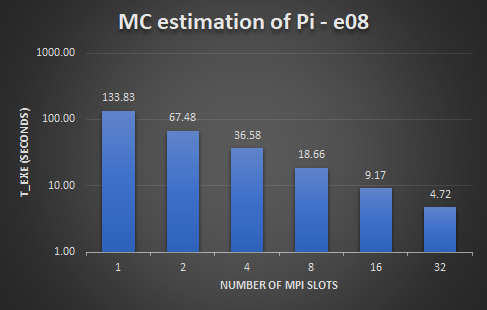
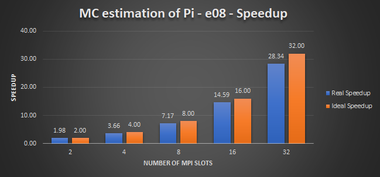
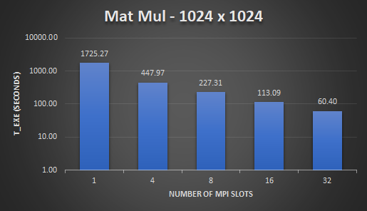
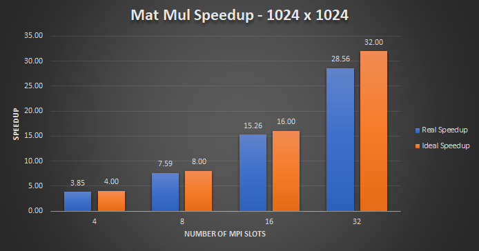
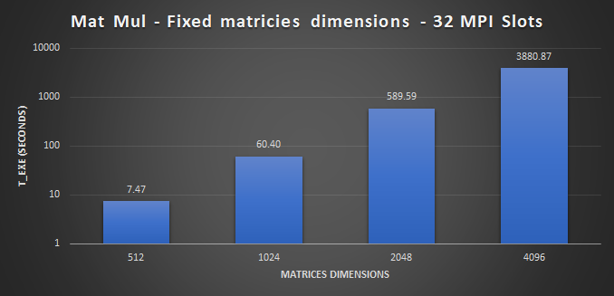

# Embarrassingly parallel algorithms with mpi4py

Matrix multiplication and Monte Carlo estimation of Pi using Python and [mpi4py](https://mpi4py.readthedocs.io/en/stable/).

This repository contains a simple implementation of these two popular parallel algorithms, a log file parser and a few orchestration shell scripts to run them. There is also a Dockerfile which can be used to quickly spin up a container on a single node for development purposes. The project has been developed as our final project for High Performance Computer Architecture course at 'Università degli Studi di Siena' under Professor Roberto Giorgi.

## Project structure

```

/$HOME/cloud
├── Dockerfile          # Docker image specs
├── requirements.txt    # Python scripts dependencies
├─┬ core                # Project main folder
│ ├── algos             # Algorithms folder
│ ├── logparsers        # Parser and logs folder
│ └── shscripts         # Shell scripts folder
└── your_machinefile    # Cluster machinefile

```

## Usage

Once your MPI environment has been set up, make sure the cluster shared folder is named ```cloud``` and is loca```$HOME``` path.

```monte_carlo_pi_runner.sh``` runs the ```algos/monte_carlo_pi.py``` for ```TEST``` times and different values of ```TRIALS``` and ```NODES``` (see the script), logging the ```monte_carlo_pi.py``` output onto a text file with the following naming convention: ```mpi.NUMBER_OF_NODES.NUMBER_OF_TRIALS_IN_SCIENTIFIC_NOTATION.log```

```sh

~/cloud/core/shscripts$ chmod 700 monte_carlo_pi_runner.sh    # give execute permission to the script
~/cloud/core/shscripts$ ./monte_carlo_pi_runner.sh            # run it

```

```mat_mul_runner.sh``` runs the ```algos/matmul.py``` for ```TEST``` times and several matrices dimensions, as well as different values of ```NODES``` (see the script), logging the ```matmul.py``` output onto a text file with the following naming convention: ```mpi.NUMBER_OF_NODES.SQUARE_MATRICES_DIMENSION.log```

```all_logs_to_csv.sh``` invokes ```logparsers/parser.py``` for each log file stored in ```$HOME/cloud/core/logparsers/logs/``` (which is created when one of the previous scripts run for the first time) which will parse your log files and generate a ```LOG_FILE_NAME.csv``` csv file.

Monte Carlo estimation of Pi csv file has the following format:

| measurements | number_mpi_slots | execution_time_slowest_node | mc_trials |
| ------------ | ---------------- | --------------------------- | --------- |
| 1            | 16               | 9.258786                    | 1e+08     |
| 2            | 16               | 9.580477                    | 1e+08     |
| 3            | 16               | 8.943837                    | 1e+08     |
| 4            | 16               | 8.906039                    | 1e+08     |

While Matrix Multiplication csv file looks like:

| measurements | number_mpi_slots | tot_execution_time_parallel_matmul | mat_dim |
| ------------ | ---------------- | ---------------------------------- | ------- |
| 1            | 4                | 51.801                             | 512     |
| 2            | 4                | 51.8218                            | 512     |
| 3            | 4                | 53.1612                            | 512     |
| 4            | 4                | 53.7941                            | 512     |

As mentioned, the Dockerfile can be used to run a container on a single host for development purposes without installing the libraries stack used on the machine. First, build the Dockerfile:

```sh

docker build -t hpcpy /path/to/dockerfile

```

Then run the resulting image on a container:

```sh

docker run --rm -it -v /path/to/project/folder:/app hpcpy

```

Alternatively, if your current working directory is the project folder, simply run:

```sh

docker run --rm -it -v ${PWD}:/app hpcpy

```

Please go through the official [Docker Documentation](https://docs.docker.com/) for more info.

## Results

The resulting csv files have been imported into Excel to generate various interesting graphs regarding the *execution time* (e.g. wall-clock time) and *speedup* for both algorithms. See [here](https://github.com/Nico769/HPCA-Project-Code/tree/master/benchmark_results) to check them all.

For Monte Carlo estimation of Pi, there were executed four runs for each number of MPI slots chosen AND for two values of ```TRIALS```. This can be pictured like so:

| Number of runs/tests | Number of MPI slots/nodes | Monte Carlo trials |
| -------------------- | ------------------------- | ------------------ |
| 4                    | 1 2 4 8 16 32             | 1e+08              |
| 4                    | 1 2 4 8 16 32             | 1e+06              |

For Matrix Multiplication the executed tests are:

| Number of runs/tests | Number of MPI slots/nodes | Matrices dimension |
| -------------------- | ------------------------- | ------------------- |
| 1                    | 1                         | 512                 |
| 4                    | 4 8 16 32                 | 512                 |
| 1                    | 1                         | 1024                |
| 4                    | 4 8 16 32                 | 1024                |
| 2                    | 4 8 16                    | 2048                |
| 1                    | 1                         | 2048                |
| 1                    | 32                        | 4096                |

The cluster used as testing environment is composed of 16 PC connected through our lab's LAN: a single PC is equipped with an Intel i3 dual-core processor and 8GB RAM.

### Monte Carlo estimation of Pi

Given the number of trials equal to , the execution time graph is:



On the horizontal axis there is the number of MPI slots while on the vertical axis the execution time  in seconds. The execution time is approximately 28 times lower (32 slots) than the execution time on a single node.

The speedup graph looks like this:



Again, the horizontal axis shows the number of MPI slots while the vertical axis the real and ideal speedup, where the real speedup is defined as  the ratio between the execution time for one MPI node over the execution time for p slots where ). It's easy to notice that the speedup is almost linear ) with respect to the number of MPI slots. This was expected considering the parallel nature of the algorithm. In fact, each node draws a pair (x,y) of points from an uniform distribution between 0 and 1 for each trial and then send to the master node the number of pairs fallen inside the unit circle; thus, the communication overhead is very low.

See [here](https://github.com/Nico769/HPCA-Project-Code/tree/master/benchmark_results) for more graphs.

### Matrix Multiplication

As mentioned, we tried several matrices dimensions. Let's focus on the 1024x1024 case. The execution graph is:



Even if there is definitely more communication overhead involved compared to the Monte Carlo simulations, the execution time is approximately 28.5 times lower (32 slots) than the execution time on a single node which is pretty close to Monte Carlo algorithm.

The speedup graph looks like this:



As for Monte Carlo, the speedup is almost linear ) with respect to the number of MPI slots.

Another interesting result is the following:



Here the horizontal axis shows the matrices dimensions while the vertical axis the execution time for a 32 slots configuration only. Notice how the cluster is having a hard time with 4096x4096 matrices! The execution time is approximately 6.5 times slower than the 2048x2048 case and the overall computation was almost 1 hour long.

See [here](https://github.com/Nico769/HPCA-Project-Code/tree/master/benchmark_results) for more graphs.

## References

[mpi4py documentation](https://mpi4py.readthedocs.io/en/stable/)

[https://stackoverflow.com/questions/18139934/can-a-monte-carlo-pi-calculation-be-used-for-a-world-record](https://stackoverflow.com/questions/18139934/can-a-monte-carlo-pi-calculation-be-used-for-a-world-record)

[http://selkie-macalester.org/csinparallel/modules/MPIProgramming/build/html/calculatePi/Pi.html](http://selkie-macalester.org/csinparallel/modules/MPIProgramming/build/html/calculatePi/Pi.html)

[https://info.gwdg.de/~ceulig/docs-dev/doku.php?id=en:services:application_services:high_performance_computing:mpi4py](https://info.gwdg.de/~ceulig/docs-dev/doku.php?id=en:services:application_services:high_performance_computing:mpi4py)

[Online CSV merge utility](http://merge-csv.com/)

## Extra

We also tested the famous [Graph500](https://github.com/graph500/graph500) benchmark suite. Click [here](https://github.com/Nico769/HPCA-Project-Code/tree/master/graph500_results) for further info.

## License

MIT - see [LICENSE](https://github.com/Nico769/HPCA-Project-Code/blob/master/LICENSE) © Francesco Casciola, Elia Giuseppe Ceroni, Nicola Landolfi
