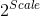
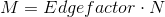
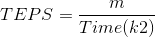

# Graph 500 Benchmark Suite Overview and Results

Results for HPCA Lab Project

## Why Graph500?

Modern computing problems, such as social networking or data mining, require the processing of large, data-centered problems, which put a heavy load on a computer's memory system, which has to perform a large number of reads and writes as fast as possible. 
Traditional Benchmarking suites, such as the well-known SPEC suite or LINPACK which defines the Top500 list, provide only information on how fast the computer can run operation, expressed in FLOPS and its multiples, while Graph500 generates a computing graph, which simulates a data-intensive workload to benchmark the communication capabilities of a machine.

## Graph500 Benchmark Structure

The benchmark generates an edge list, on which it builds a graph ( *Kernel 1*) and then generates 64 unique search keys. For each search key, depending on the selected kernel, the benchmark implements a Breadth First Search (BFS, *Kernel 2*, for each key calculates the parent array) and validates the result. In addition, if *Kernel 3* is requested, it implements a Single Source Shortest Path (SSSP, for each key calculates the parent array and the distance array).

## Benchmark Parameters

* **Scale** = Logarithm base two of the number of edges in the generated graph.
* **Edgefactor** = Ratio between the number of edges and the graph's vertex count.
* **N** = Number of vertices in the graph, 

* **M** = Number of edges in the graph, 

The benchmark's script accepts in input the **Scale** and the **Edgefactor**.

## Kernels Overview

### Graph Generation (Kernel 1)

This kernel generates the graph using a Kronecker generator that, in a recursive way, subdivides the adjacency matrix of the graph into four equal-sized partitions, A, B, C, D, and distributes edges within these partitions with unequal probabilities, adding them one at a time to the initially empty adjacency matrix.

### BFS (Kernel 2)

The Breadth First Search finds a node by starting from the graph root, or in general a node in the graph, defined as "search key",  and exploring all of the neighbouring nodes at the same depth (distance from the search key).

### SSSP (Kernel 3)

The Single Source Shortest Path algorithm finds the shortest distance from a given starting vertex to every other vertex in the graph. The Graph500 benchmark suite does not specify a particular SSSP algorithm, it only imposes the input and the output, and some constraints on the computation.

For our testing purposes, we did not change the parameters of the kernels of the suite.

## Metrics

The major metric used by Graph500 is the **TEPS**, Traversed Edges Per Second, calculated as:

Where **m**  is the number of undirected edges in a traversed component of the graph and **Time(k2)** is the  execution time of kernel 2 (BFS)

To calculate the TEPS value for kernel 3 (BFS + SSSP), Time(k3) is used.

## Tested Benchmark Parameters and Cluster Specifications

We tested our computer lab's cluster (Room 147), composed of 16 machines, each equipped with a dual-core Intel I3 processor and 8 GB of RAM.

We ran the benchmark multiple times for each tuple (Scale, Edgefactor) of parameters.
The Scale parameter ranged between 10 and 15, while we used 4, 8, 16, and 32 for the Edgefactor.

## Results overview

The TEPS value is obtained by doing the mean of the TEPS obtained from each run and each Edgefactor.

This plot clearly shows that for the execution of kernel 2, once there are more than two MPI slots, so when there is an actual need to use the interconnection network of the cluster, the TEPS performance value drops by two orders of magnitude from the value obtained on a single node of the cluster.

This plot instead, shows in detali that even by adding slots, the performance continues to decrease.

This other plot shows a situation similar to the one with Scale = 10, but it shows a slight improvement on the TEPS value as we add MPI slots.

And it can be better seen here.
It can then be concluded that, as the problem size increases, the communication overhead gets a little less significant.

This plot shows in comparison the TEPS value obtained running kernel 2 and kernel 3 and shows a similar trend to the kernel 2 only graph.

Same as the previous plot, but this one focuses only on two or more nodes of the cluster.

These are the results for Scale = 15, like the BFS-only kernel, we see that an increase in the problem size benefits the performance as the number of MPI slots increases.

In this second plot for Scale = 15, we can see in detail the increase of the TEPS value, which is more evident thanks to the increased problem size and also similar both for kernel 2 and kernel 3.

## Comparison with our other benchmarks

It can be observed, by looking at the results of the executions of the Matrix Multiplication and the Pi Estimation with Montecarlo Simulation, that the used performance metric for the execution, the **Speedup** , which is defined as the ratio between the execution time of the serial version of the algorithm (the reference time)  and the execution time with  multiple MPI Slots, keeps increasing as the algorithms have access to more and more resources. This methodology however does not give any info on the general performance of the cluster, as evidenced by the results given by the Graph500. The suite shows effectively how, with a computational problem that relies heavily on the performance of the interconnection network, as soon as we need to use more than one node of the cluster (more than two MPI Slots) the performance metrics get substantially reduced.